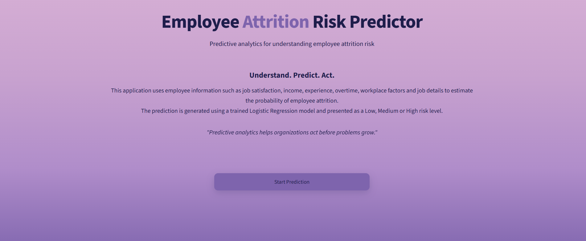
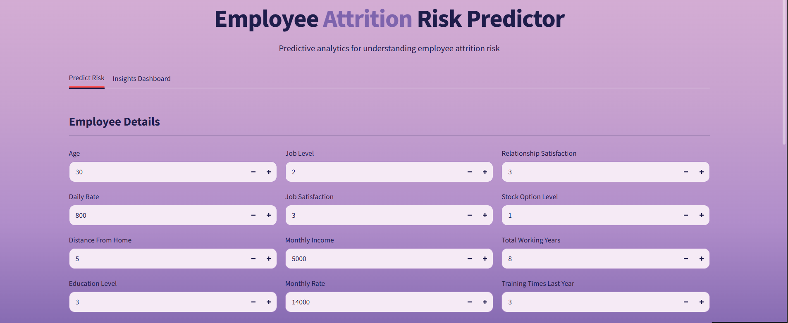
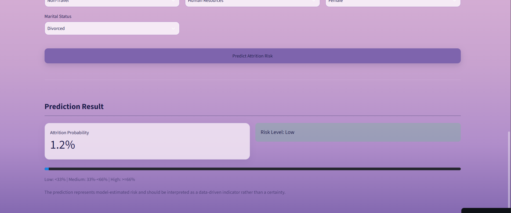
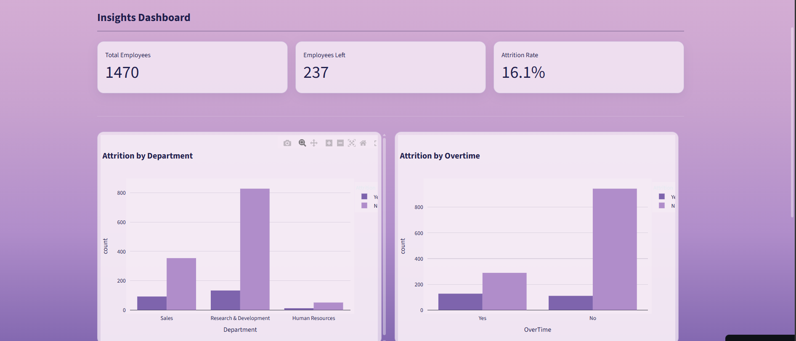

# Employee Attrition Risk Predictor

**Hackathon:** Arya's Domain Verse 1.0 — Internal Hackathon
**Domain:** Data Science
**Problem Statement:** PS-05 — Employee Attrition Analysis & Prediction
**Section:** Alpha
**Submission Type:** Individual

---
## Live Demo

[Try the live application](https://attrition-predictor-domainverse.streamlit.app/)

## Table of Contents

1. [Overview](#overview)
2. [Problem Statement](#problem-statement)
3. [Objective](#objective)
4. [Dataset](#dataset)
5. [Approach and Methodology](#approach-and-methodology)
6. [Model Training and Comparison](#model-training-and-comparison)
7. [Risk Classification Logic](#risk-classification-logic)
8. [Key Insights](#key-insights)
9. [Application Overview](#application-overview)
10. [How to Use the Application](#how-to-use-the-application)
11. [Repository Structure](#repository-structure)
12. [Technology Stack](#technology-stack)
13. [Installation and Setup](#installation-and-setup)
14. [Running the Project](#running-the-project)
15. [Live Demo](#live-demo)
16. [Screenshots](#screenshots)
17. [Limitations](#limitations)
18. [Future Improvements](#future-improvements)
19. [Author](#author)

---

## Overview

This project is a working prototype built for the Data Science domain of Arya's Domain Verse 1.0, an individual 6-hour internal hackathon. It analyzes employee data and predicts the likelihood that a given employee will leave the organization, presenting the result as an easy-to-interpret risk level along with supporting data insights.

The project covers the complete data science workflow: data cleaning, exploratory analysis, feature engineering, model training and comparison, and deployment as an interactive web application.

---

## Problem Statement

Organizations invest significant time and resources in recruiting and training employees. When employees leave unexpectedly, it disrupts productivity and increases hiring and onboarding costs. Companies often already possess the data needed to anticipate this — information such as salary, job role, working hours, satisfaction levels, overtime status, promotion history, and distance from the workplace — but this data is rarely analyzed proactively.

This project addresses that gap by building a data-driven system that analyzes employee information and predicts whether an employee belongs to an attrition-risk category, giving HR teams and organizations the ability to identify at-risk employees before they leave.

**Primary users:** HR teams, organizations, and business analysts.

---

## Objective

Build an employee attrition analysis and prediction system that:

- Trains a classification model to predict employee attrition.
- Identifies the factors most strongly associated with attrition.
- Converts model output into a simple Low, Medium, or High risk indicator.
- Compares the performance of two different classification approaches.
- Presents the results through a usable, interactive interface rather than only a notebook.

---

## Dataset

**Source:** IBM HR Analytics Employee Attrition & Performance Dataset (Kaggle)
**Link:** https://www.kaggle.com/datasets/pavansubhash/ibm-hr-analytics-attrition-dataset

The dataset contains 1,470 employee records with 35 attributes. After removing four columns that carry no predictive information (explained below), the following features were used:

**Demographic and personal attributes:**
Age, Gender, MaritalStatus, DistanceFromHome, Education, EducationField

**Job and role attributes:**
Department, JobRole, JobLevel, JobInvolvement, BusinessTravel, StockOptionLevel

**Compensation attributes:**
MonthlyIncome, MonthlyRate, DailyRate, HourlyRate, PercentSalaryHike

**Satisfaction and work-life attributes:**
JobSatisfaction, EnvironmentSatisfaction, RelationshipSatisfaction, WorkLifeBalance, OverTime, PerformanceRating

**Experience and tenure attributes:**
TotalWorkingYears, NumCompaniesWorked, TrainingTimesLastYear, YearsAtCompany, YearsInCurrentRole, YearsSinceLastPromotion, YearsWithCurrManager

**Target variable:**
Attrition (Yes / No), converted to binary (1 / 0) during preprocessing.

**Columns removed during cleaning:**
`EmployeeCount`, `StandardHours`, and `Over18` were removed because they hold a single constant value across every record and therefore contribute no information to the model. `EmployeeNumber` was removed because it is a unique identifier with no genuine relationship to attrition.

---

## Approach and Methodology

The project follows a standard, structured data science pipeline:

**Step 1 — Data Cleaning**
Loaded the raw dataset, checked for missing values and duplicate records, removed non-predictive columns, and converted the target column to a numeric binary format.

**Step 2 — Exploratory Data Analysis**
Analyzed attrition patterns across department, overtime status, income level, and job satisfaction. Generated a correlation heatmap across all numeric features to understand relationships between variables. All charts generated during this step are saved under `outputs/figures/`.

**Step 3 — Feature Engineering**
All categorical columns (Department, JobRole, MaritalStatus, BusinessTravel, EducationField, Gender, OverTime) were converted into numeric form using one-hot encoding. This expanded the original 30 usable columns into approximately 44 model-ready features.

**Step 4 — Train-Test Split**
The dataset was split into training and testing sets using an 80/20 split, with stratification on the target variable to preserve the same attrition ratio in both sets.

**Step 5 — Model Training**
Two classification models were trained independently on the same training data:
- Logistic Regression, with input features scaled using `StandardScaler`.
- Random Forest Classifier, which does not require feature scaling.

Both models were trained with `class_weight="balanced"` to account for the imbalance between employees who stayed and employees who left.

**Step 6 — Model Evaluation and Selection**
Both models were evaluated on the held-out test set using Accuracy, Precision, Recall, F1-score, ROC-AUC, and a confusion matrix. The results are detailed in the section below.

**Step 7 — Feature Importance**
Feature importance values were extracted from the trained model to identify which factors are most strongly associated with attrition.

**Step 8 — Risk Classification**
The model's predicted probability of attrition was converted into a three-tier Low / Medium / High risk label for easier interpretation by a non-technical user such as an HR manager.

**Step 9 — Deployment**
The trained model, scaler, and expected column structure were saved using `joblib` and loaded into a Streamlit web application that allows a user to enter an employee's details and receive a live prediction, alongside a dashboard summarizing dataset-wide patterns.

---

## Model Training and Comparison

Two classification models were trained and compared on identical training and test splits.

| Metric | Logistic Regression (Selected) | Random Forest |
|---|---|---|
| Accuracy | 0.752 | 0.823 |
| Precision | 0.345 | 0.419 |
| Recall | 0.617 | 0.277 |
| F1-Score | 0.443 | 0.333 |
| ROC-AUC | 0.798 | 0.778 |

**Model selected: Logistic Regression**

Although Random Forest achieved a higher raw accuracy, this metric is misleading on this dataset because the classes are imbalanced — approximately 84 percent of employees stay and 16 percent leave. A model can achieve a high accuracy score simply by predicting "stays" for most cases, without meaningfully identifying employees who are actually at risk.

Logistic Regression achieved substantially higher Recall (0.617 versus 0.277), meaning it correctly identified more than double the number of employees who actually left, compared to Random Forest. It also scored higher on F1-score and ROC-AUC, both of which account for the class imbalance more fairly than accuracy alone. Since the practical cost of failing to identify an at-risk employee is higher than the cost of a false alarm, Recall and F1-score were prioritized over raw accuracy when selecting the final model.

---

## Risk Classification Logic

The selected model outputs a probability between 0 and 1, representing the likelihood that a given employee will leave. This probability is converted into a three-level category:

| Probability Range | Risk Level |
|---|---|
| Below 0.33 | Low |
| 0.33 to below 0.66 | Medium |
| 0.66 and above | High |

This conversion makes the output interpretable at a glance, without requiring the end user to understand the underlying probability score.

---

## Key Insights

The following patterns were identified during exploratory data analysis and are reflected in the charts saved under `outputs/figures/`:

- Employees who work overtime show a noticeably higher attrition rate than those who do not.
- Sales has a higher proportion of employees leaving compared with the other departments.
- Employees who left generally have lower monthly income distributions than those who stayed.
- Most numerical features show relatively weak correlations with attrition, suggesting that attrition is influenced by multiple factors.

---

## Application Overview

The project is deployed as a two-tab Streamlit web application.

**Tab 1 — Predict Risk**
Allows a user to enter details for a single employee across personal, job-related, compensation, and satisfaction attributes. On submission, the application returns the predicted attrition probability and a corresponding Low, Medium, or High risk label.

**Tab 2 — Insights Dashboard**
Displays summary statistics for the full dataset, including total employee count, number of employees who left, and overall attrition rate, along with visual breakdowns of attrition by department, by overtime status, and by monthly income.

---

## How to Use the Application

1. Launch the application using the instructions in the [Running the Project](#running-the-project) section.
2. On the landing screen, click **Start Prediction** to proceed to the main interface.
3. In the **Predict Risk** tab, fill in the employee details across all three columns under "Employee Details" and both columns under "Job Information." Every field has a sensible default value already selected.
4. Click **Predict Attrition Risk**.
5. Review the result: the attrition probability is shown as a percentage, alongside a color-coded risk label (green for Low, orange for Medium, red for High) and a progress bar for quick visual reference.
6. Switch to the **Insights Dashboard** tab at any time to view overall attrition statistics and comparative charts across the full dataset.

---

## Repository Structure

```
attrition-predictor-domainverse/
|
|-- app/
|   `-- app.py                     Streamlit application (prediction and dashboard)
|
|-- data/
|   `-- employee_attrition.csv     Source dataset (IBM HR Analytics)
|
|-- notebooks/
|   `-- EDA_and_Model.ipynb        Data cleaning, EDA, feature engineering, model training
|
|-- outputs/
|   |-- figures/                   Saved charts generated during EDA and model evaluation
|   |   |-- 01_attrition_overall.png
|   |   |-- 02_attrition_overtime.png
|   |   |-- 03_attrition_department.png
|   |   |-- 04_income_vs_attrition.png
|   |   |-- 05_correlation_heatmap.png
|   |   `-- 06_feature_importance.png
|   |-- attrition_model.pkl        Trained Logistic Regression model
|   |-- scaler.pkl                 Fitted StandardScaler used before prediction
|   `-- model_columns.pkl          Exact column list and order expected by the model
|
|-- docs/
|   `-- (screenshots of the running application, added before submission)
|
|-- requirements.txt 
|-- screenshots
|   |-- predict.png
|   |-- dashboard.png  
|   |-- result.png            Python package dependencies
|-- README.md                      Project documentation (this file)
`-- .gitignore                     Files and folders excluded from version control
```

---

## Technology Stack

| Category | Tools Used |
|---|---|
| Programming Language | Python |
| Data Handling | pandas, numpy |
| Data Visualization | matplotlib, seaborn, plotly |
| Machine Learning | scikit-learn (Logistic Regression, Random Forest Classifier) |
| Model Persistence | joblib |
| Web Application | Streamlit |
| Development Environment | Jupyter Notebook, Visual Studio Code |
| Version Control | Git and GitHub |

---

## Installation and Setup

**Prerequisites:** Python 3.10 or later, and Git installed on your system.

**Step 1 — Clone the repository**
```bash
git clone https://github.com/dakshita01/attrition-predictor-domainverse
cd attrition-predictor-domainverse
```

**Step 2 — Create and activate a virtual environment**
```bash
python -m venv venv
```
On Windows:
```bash
venv\Scripts\activate
```
On Mac or Linux:
```bash
source venv/bin/activate
```

**Step 3 — Install project dependencies**
```bash
pip install -r requirements.txt
```

---

## Running the Project

**To explore the analysis and model training process:**
Open `notebooks/EDA_and_Model.ipynb` in Jupyter Notebook or VS Code and run all cells in order.

**To run the interactive application:**
```bash
streamlit run app/app.py
```
This will automatically open the application in your default web browser, typically at `http://localhost:8501`. If it does not open automatically, copy the URL shown in the terminal into your browser.

---

## Live Demo

The application is deployed and available at:

[Add your deployed Streamlit link here](https://attrition-predictor-domainverse.streamlit.app/)

If the link above is not active, the application can be run locally by following the steps in the [Running the Project](#running-the-project) section.

---

## Screenshots

*(Add screenshots of the running application to the `docs/` folder, then reference them below using the file names you saved them as.)*

**Dashboard**



**Prediction Interface**



**Result Dashboard**



**Insights Dashboard**



---

## Limitations

- The model is trained on a single dataset representing one organization's employee records. Its predictions reflect patterns specific to this dataset and would need to be retrained on new data to generalize to a different organization with a different employee profile.
- The current dataset is imbalanced, with far fewer employees who left than employees who stayed. While this was addressed using class weighting, the model's precision remains lower than its recall as a result.
- The application interface currently covers the majority of the model's input features but simplifies a small number of less impactful fields to keep the form usable within the time available.

---

## Future Improvements

- Incorporate SHAP (SHapley Additive exPlanations) values to explain individual predictions, showing exactly which factors contributed to a specific employee's risk score.
- Add support for batch predictions through CSV upload, allowing an entire team or department to be evaluated at once.
- Experiment with additional models such as Gradient Boosting or XGBoost, along with hyperparameter tuning, to further improve recall and precision.
- Introduce a historical tracking feature to monitor how an employee's predicted risk changes over time.

---

## Author

**Dakshita Biwal**

B.Tech Computer Science and Engineering, 3rd year
Arya College of Engineering
